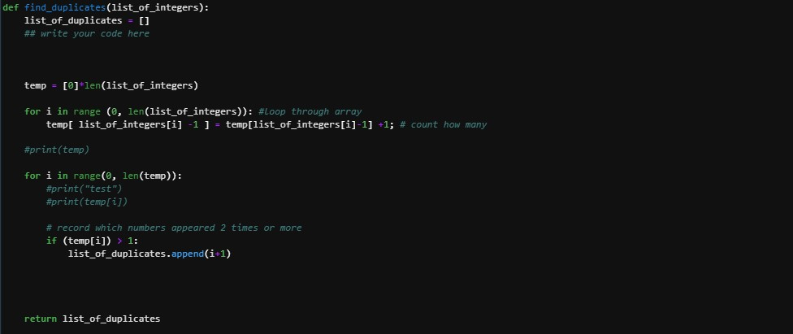

Finding Duplicates is a program that returns which number appeared more than once. It was for the ICS 141 : Discrete Mathematics 1 and is coded in Python and created in JupyterLab. 

My role in this assignment was to completely implement a program.

In this project, I learned more about BigO and time complexity. The task for the assignment was not only to find the duplicate numbers but to do so with a time complexity of O(n).
 
Source: <a href="https://github.com/JoyT808/Projects/blob/main/FindDuplicates">Finding Duplicates</a>
