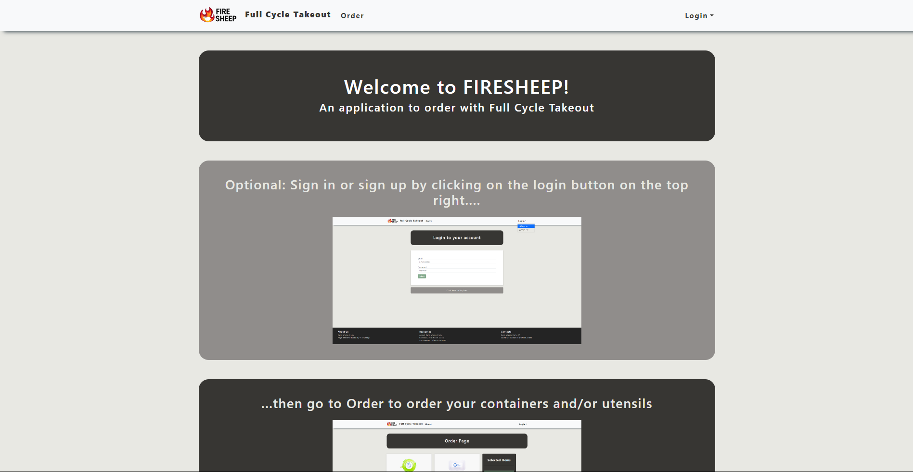

In Fall 2023, I've participated in the Hawaii Annual Code Challenge with Anson Leung, Chien Hua Shu, and Samuel Yang. We choose the challenge provided by Zero Waste Hawaii. The Zero Waste Oahu organization was trying to replace one time use plastic takeout containers with reusable ones and have customers return them after they are done.

The main objective was to find a better way to keep customers accountable for returning the reusable containers and for the solution to be efficient and fast for all events. Our plan was to create an application for users to easily place their orders with Full Cycle Takeout.

For this project my main role was to work on the front end of the application. It involved planning, teamwork, conceptualization, and the execution of visual elements to create an engaging and functional website that will be easy for users to use. 
One crucial aspect of web design is the use of colors since it plays a significant role in shaping the user experience.

Choosing the right colors for a website was a bit challenging process for me and required a lot of testing. I've learnt that choosing colors isn't only about personal preference. There are certain colors
that goes well together and some that don't. To have a nice website, a harmonious color palette is crucial and limiting the amount of colors you have is 
important in order for it to look clean and better allow you to highlight what components are more important than the other. 
 
Source: <a href="https://314firesheep.github.io/">Firesheep</a>
