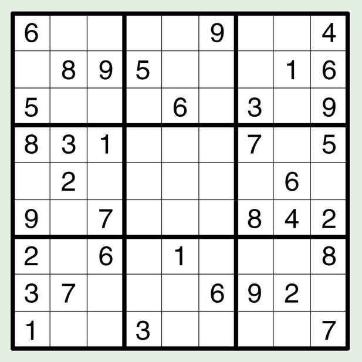

This program finds the solution for sudoku puzzles that was for ICS 211 : Introduction to Computer Science II. The Sudoku Solver was created in Eclipse and written in Java. In SudokuTest class, you can input a sudoku puzzle and it will solve it for you. 

My main role in this code was to implement the missing and the main code to get the program to work.

In this assignment I learned more about how to use for loops and the necessary conditions and precautions to prevent errors from appearing. In this assignment was also to help familiarize and use 2D arrays and practicing coding in Java.
 
Source: <a href="https://github.com/JoyT808/Sudoku">Sudoku</a>
